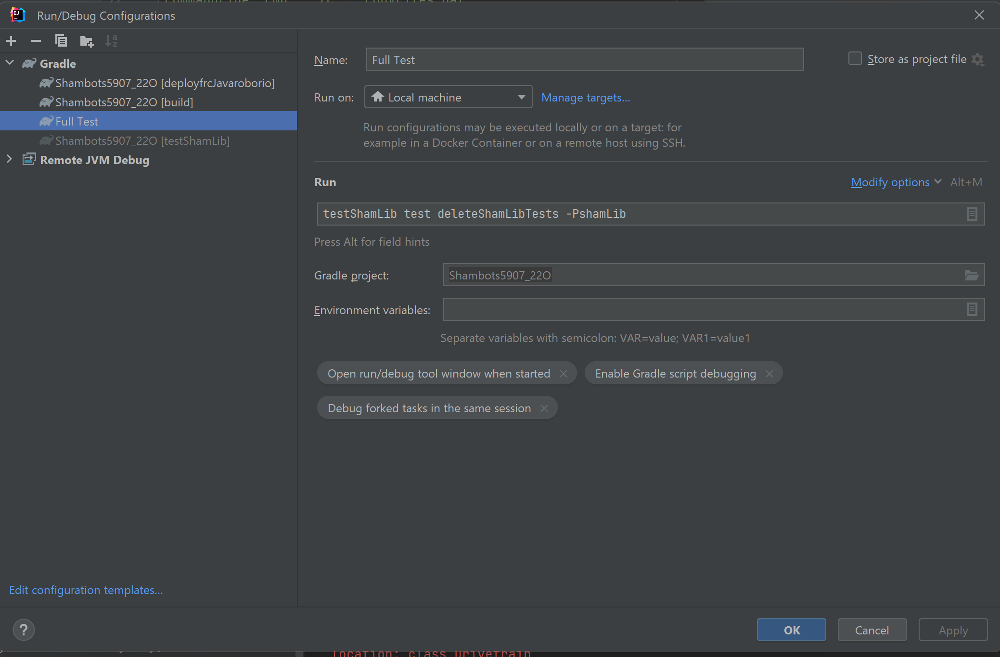

# Introduction

## Installation
Open your WPILib project in the command line and cd into a util package with the following tree `{parentProject}\src\main\java\frc\robot\` and run the following command: `git submodule add https://github.com/CCShambots/ShamLib.git`


[//]: # (## Documentation)

[//]: # (Here is a link to the full documentation for the SMF - [Documentation]&#40;https://jbfit2014.gitbook.io/frc-smf-documentation/&#41;)


## Unit Testing

To run unit tests in a robot project from the shamlib tests, add the following to your build.gradle: 
```
task testShamLib(type:Exec) {
workingDir 'src/main/java/frc/robot/ShamLib/test'
commandLine 'cmd', '/c', 'copyFiles.bat'
}

task deleteShamLibTests(type:Exec) {
workingDir 'src/main/java/frc/robot/ShamLib/test'
commandLine 'cmd', '/c', 'clearFiles.bat'
}

if(project.hasProperty("shamLib")) {
test.mustRunAfter(testShamLib)
deleteShamLibTests.mustRunAfter(test)
}
```

Perform a gradle sync

Then create the following gradle task:


Place all your tests in /Shamlib/test/